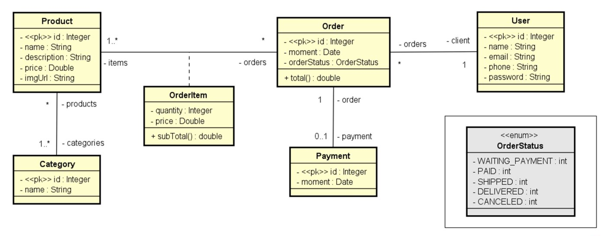

# Web Service com Springboot e JPA
[](https://github.com/RUNNN00/workshop-springboot-jpa/blob/main/LICENSE)

Por [Ruan Azevedo](https://www.linkedin.com/in/ruan-azevedo-904203151)

# Sobre o projeto

Este é um projeto de aprendizagem das ferramentas **Springboot** e **JPA**, curso organizado pela [DevSuperior](https://devsuperior.com "Site da DevSuperior").

Esta aplicação é um simples sistema Web Service que consiste numa lógica de compra de produtos genéricos. Você pode trabalhar com os dados por meio de requisições REST.

## Modelo conceitual


# Tecnologias utilizadas
- Java
- Spring Boot
- JPA / Hibernate
- Maven
- Banco de dados: H2

# Como executar o projeto
Pré-requisitos: Java 17

```bash
# clonar repositório
git clone https://github.com/RUNNN00/workshop-springboot-jpa.git

# entrar na pasta do projeto back end
cd workshop-springboot-jpa

# executar o projeto
./mvnw spring-boot:run
```
No seu browser, acessar:

- http://localhost:8080/users para acessar os dados de usuários.
- http://localhost:8080/products para acessar os dados dos produtos.
- http://localhost:8080/orders para acessar os dados de pedidos.

Você pode utilizar o [**Postman**](https://www.postman.com) para fazer as requisições REST.

Lembrando que o banco de dados H2 funciona na memória dinâmica, portanto os dados não são persistentes.

